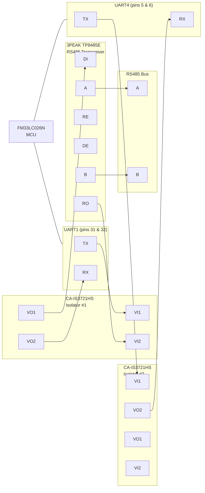

# RS485 Signal Path

Signal trace from the FM33LC026N MCU to the RS485 bus, through isolators and transceiver.

> **Note:** The original Excalidraw source is preserved in
> [`rs485-trace-mapping.excalidraw.md`](rs485-trace-mapping.excalidraw.md) for reference.
